# ai_asset — AI pipeline for 2D mobile-game assets

Turn **reference images** into a structured **style guide**, then into a ready-to-use **image prompt** for producing on-style 2D assets — **UI/UX** (screens, icons, buttons, panels), **backgrounds**, **characters**, and **objects/props**. **Generator-neutral** — which image generator you use for the prompt (gpt-image / Gemini "Nano Banana" / Midjourney…) is entirely up to you.

> **How to use:** paste **[`studio_primer.md`](studio_primer.md)** as the first message of a fresh chat with any vision-capable LLM (a regular ChatGPT account is enough), attach your reference images, then type `STYLE` and `ASSET:` to get a style guide and prompt right in the chat. Full step-by-step below.

The toolkit **stops at the prompt** — choosing a generator and generating the image is on you.

---

## Demo — one reference screenshot in, a whole on-style asset set out

**Demo 1 — cartoon knight game.** Input: a single Victory screen used as the STYLE ref. Outputs below were generated from prompts produced by `STYLE` → `ASSET:` / `CHARACTER:` (pose variation) / `OBJECT:` / UI-kit sheet:

<table>
  <tr>
    <th>STYLE ref (input)</th>
    <th colspan="4">Generated from the primer's prompts (output)</th>
  </tr>
  <tr>
    <td>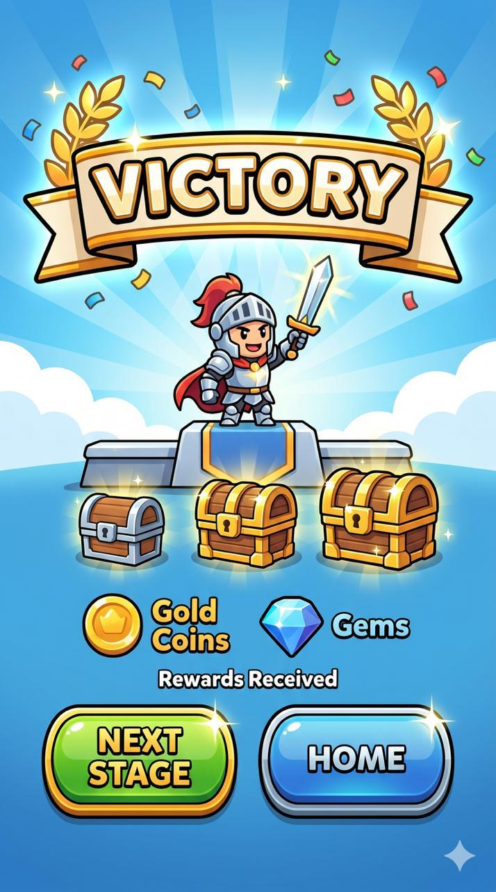</td>
    <td>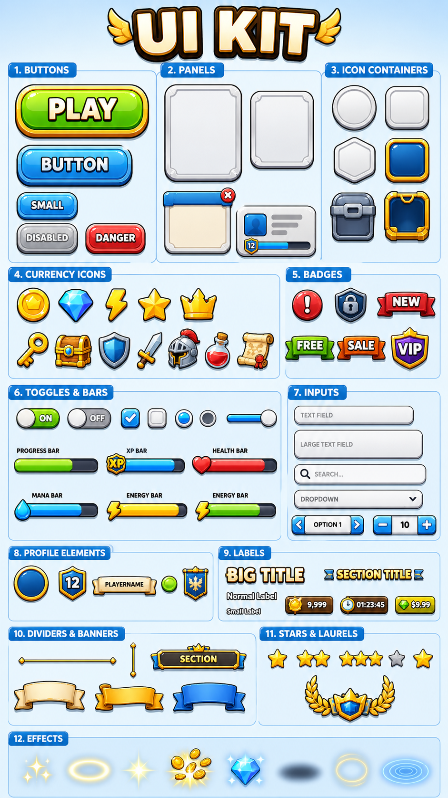</td>
    <td>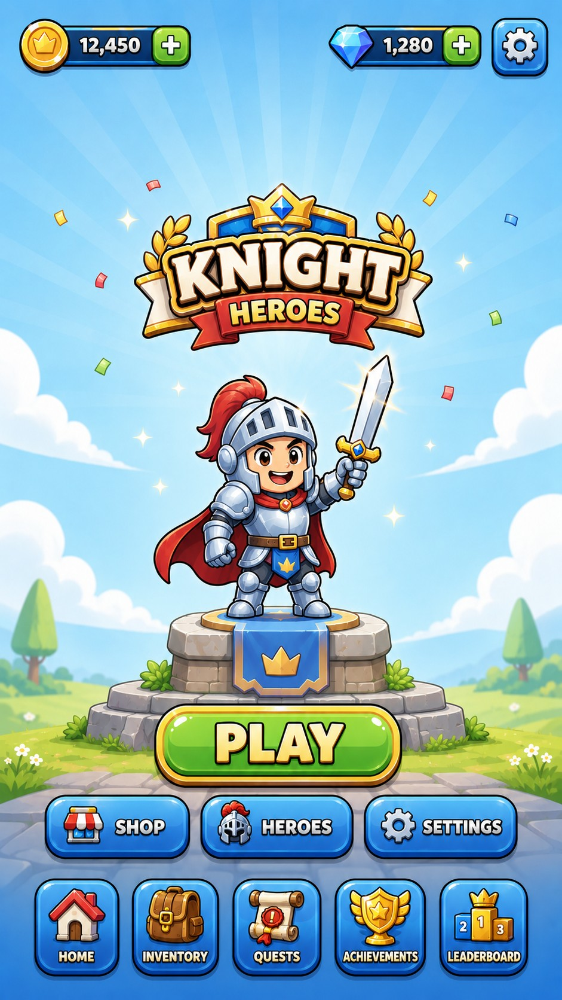</td>
    <td>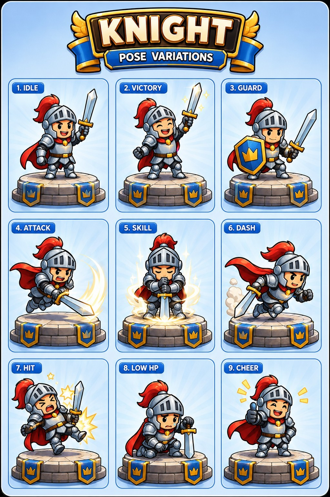</td>
    <td>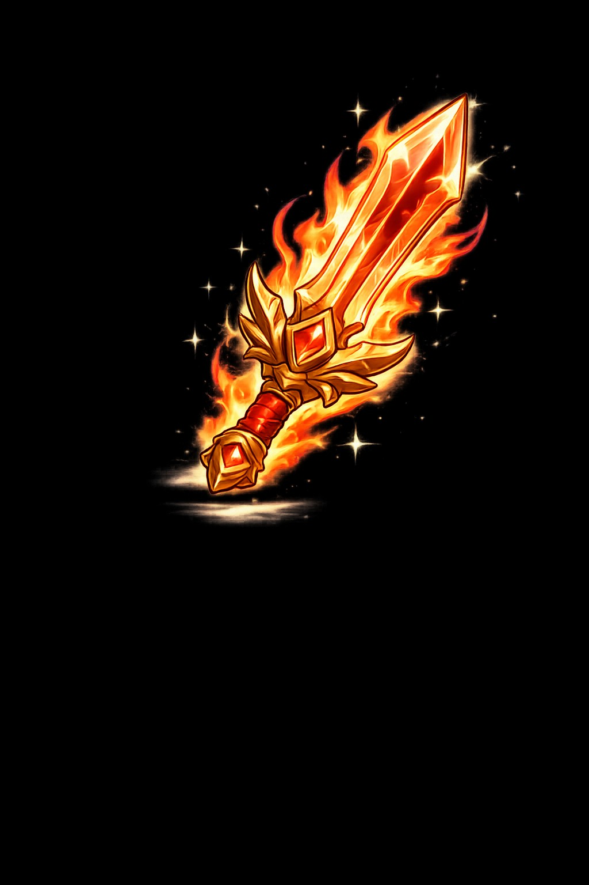</td>
  </tr>
  <tr>
    <td align="center"><sub>Victory screen ref</sub></td>
    <td align="center"><sub><code>ASSET:</code> UI-kit sheet</sub></td>
    <td align="center"><sub><code>ASSET:</code> home screen</sub></td>
    <td align="center"><sub><code>CHARACTER:</code> pose variation</sub></td>
    <td align="center"><sub><code>OBJECT:</code> prop</sub></td>
  </tr>
</table>

**Demo 2 — minimalist chess puzzle app.** Input: one in-game screenshot as the STYLE ref — the whole screen set stays in its soft, muted style:

<table>
  <tr>
    <th>STYLE ref (input)</th>
    <th colspan="5">Generated from the primer's prompts (output)</th>
  </tr>
  <tr>
    <td>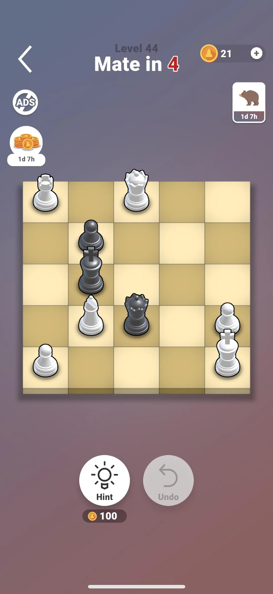</td>
    <td>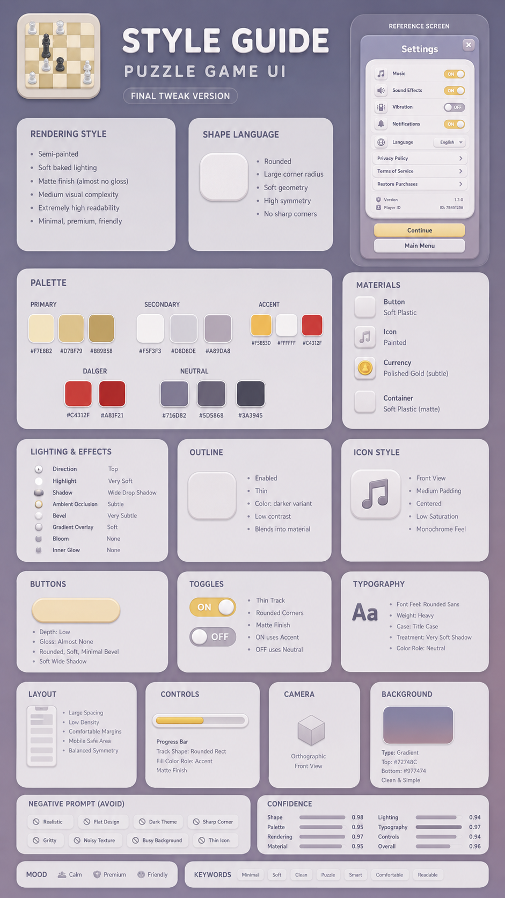</td>
    <td>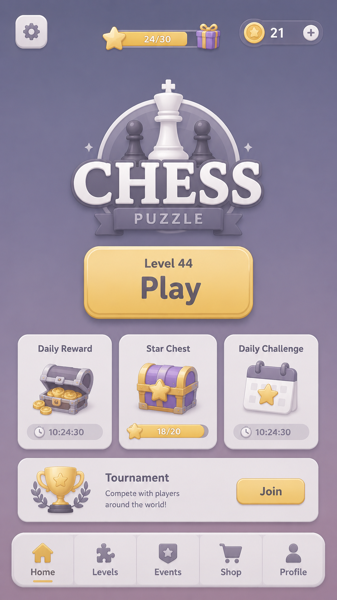</td>
    <td>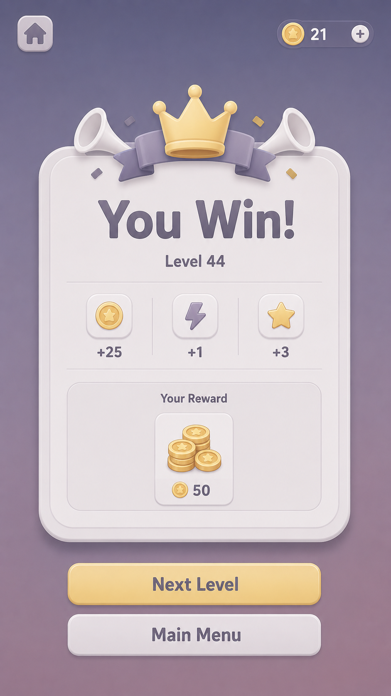</td>
    <td>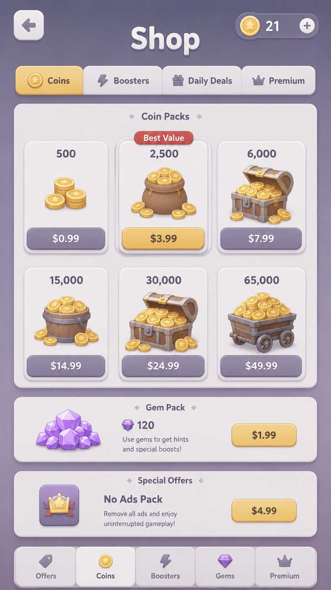</td>
    <td>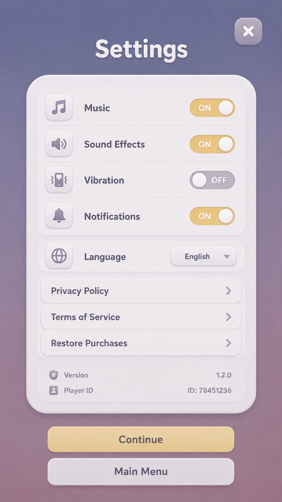</td>
  </tr>
  <tr>
    <td align="center"><sub>in-game screenshot ref</sub></td>
    <td align="center"><sub>UI-kit sheet</sub></td>
    <td align="center"><sub>main screen</sub></td>
    <td align="center"><sub>win screen</sub></td>
    <td align="center"><sub>shop</sub></td>
    <td align="center"><sub>settings</sub></td>
  </tr>
</table>

**Demo 3 — pixel-art platformer background (`BACKGROUND:`).** Input: one pixel-art forest level as the STYLE ref → a brand-new desert/pyramid level background in the same pixel register, palette feel and cloud/terrain language:

<table>
  <tr>
    <th>STYLE ref (input)</th>
    <th>Generated (output)</th>
  </tr>
  <tr>
    <td>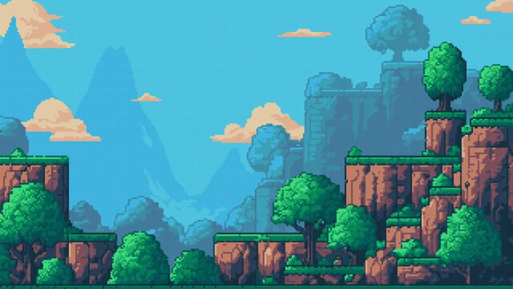</td>
    <td>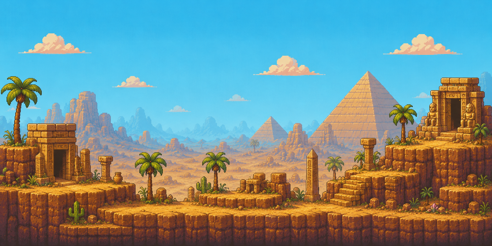</td>
  </tr>
  <tr>
    <td align="center"><sub>forest level ref</sub></td>
    <td align="center"><sub><code>BACKGROUND:</code> desert ruins level</sub></td>
  </tr>
</table>

**Demo 4 — retro 16-bit beat-'em-up.** Input: one SNES-era gameplay screenshot as the STYLE ref → a brand-new title screen and gameplay scene that keep the 16-bit pixel register, grungy industrial palette and chunky HUD language:

<table>
  <tr>
    <th>STYLE ref (input)</th>
    <th colspan="2">Generated from the primer's prompts (output)</th>
  </tr>
  <tr>
    <td>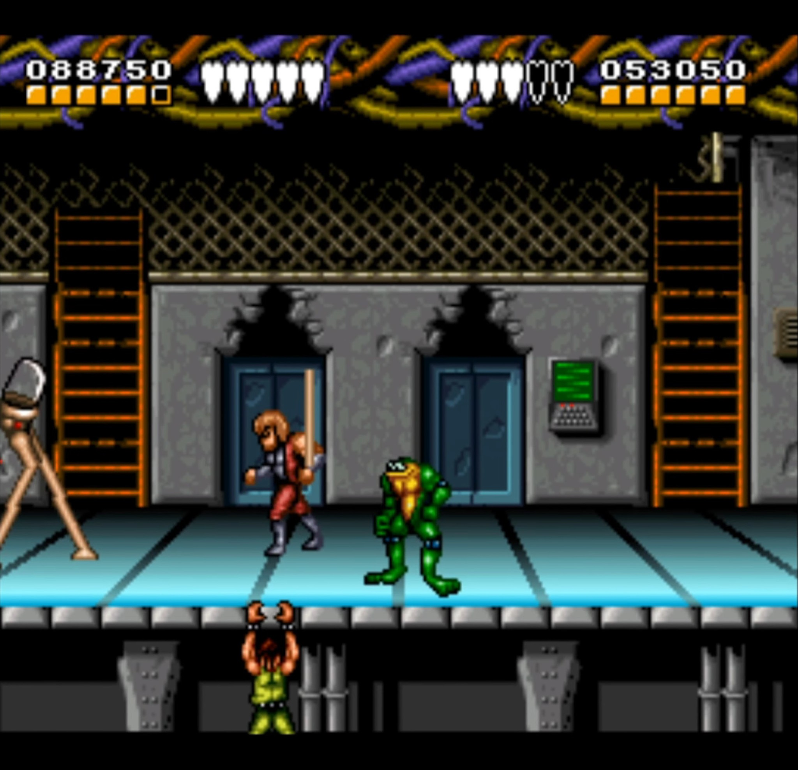</td>
    <td>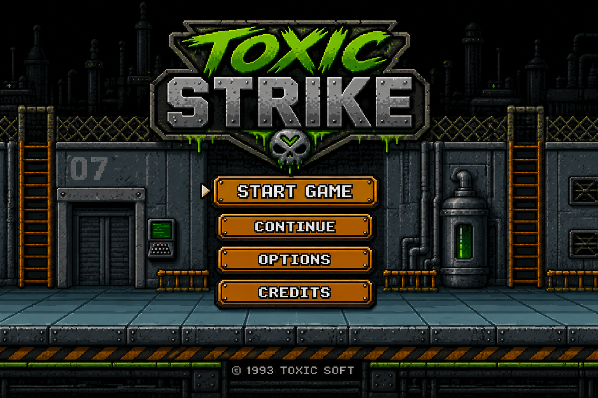</td>
    <td>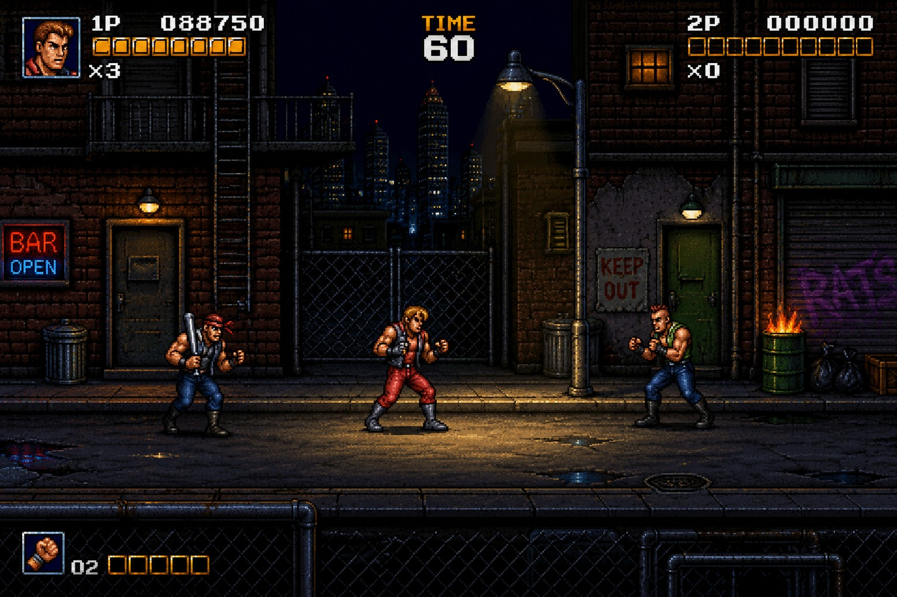</td>
  </tr>
  <tr>
    <td align="center"><sub>gameplay screenshot ref</sub></td>
    <td align="center"><sub><code>ASSET:</code> title screen</sub></td>
    <td align="center"><sub><code>ASSET:</code> gameplay scene</sub></td>
  </tr>
</table>

---

## Quick start

1. Open a fresh chat in a vision-capable LLM (ChatGPT, Claude, or Gemini).
2. Paste the entire contents of `studio_primer.md` as the first message.
3. Attach your **STYLE references** (images whose art style you want to learn) and type `STYLE` → you get a `style_guide.yaml`.
4. Review it (fix hex colors with an eyedropper; confirm low-confidence fields) and send the fixes back with `UPDATE:`.
5. Type `ASSET: <description>` → you get a finished image prompt.
6. Take the prompt to the image generator of your choice. Bring the result back and type `CHECK` — copy its consolidated `TWEAK:` line to fix any drift.

---

## Repo structure

```
README.md            ← you are here (overview + full usage guide)
studio_primer.md     ← THE TOOL: a self-contained mega-prompt you paste into an LLM chat
schema/              ← SOURCE: field + enum definitions (the primer is built from these)
  style_guide.schema.yaml
  asset_spec.schema.yaml   layout_spec.schema.yaml   (optional structured asset description — UI)
  background_spec.schema.yaml  character_spec.schema.yaml  object_spec.schema.yaml
                           (optional structured descriptions for backgrounds / characters / objects)
style_tokens/        ← SOURCE: STYLE DICTIONARY, enum → English phrase (built into the primer; seeded from the PDFs)
  materials.yaml  render_shape.yaml  light_color.yaml  layout_negative.yaml  character_environment.yaml  ui_components.yaml
demo/                ← the showcase above: 3 real runs (input STYLE ref + generated outputs)
doc/                 ← local reference material (third-party prompt-collection PDFs; not included in this repo)
examples/
  settings_screen/   ← sample output (style_guide.yaml + prompt)
  mascot_character/  ← sample character output (character_spec + prompt + pose-variation prompt)
  analyzer_smoke_test/ ← proof the analyzer runs on a real asset image
```

---

## How it works

`studio_primer.md` is **the tool** — a self-contained mega-prompt **built from** `schema/` (valid enums) + `style_tokens/` (enum → phrase dictionary). It bundles three jobs into one chat — ANALYZER (`STYLE`), SYNTHESIZER (`ASSET`/`CHARACTER`/`BACKGROUND`/`OBJECT`) and CHECKER (`CHECK`):

```
STYLE ref ──► [ STYLE ] ──► style_guide.yaml (enums)  ─┐
                                                       │
   asset (text | TARGET ref | empty→AI-suggested) ─────┴─► [ ASSET | CHARACTER | BACKGROUND | OBJECT ] ──► prompt (generator of your choice)

CHARACTER ref ──► [ CHARACTER ] ──► pose-variation prompt (image-edit; identity locked, only the pose changes)
```

- **Everything is drawn fresh.** Every asset comes out of the SYNTHESIZER: the prompt carries the whole style (from the `style_guide`, with your eyedropper-verified hex). The toolkit has no extract/upscale path — a generative model can't keep source pixels; when you need a matching component set, generate a **UI-KIT sheet** instead.
- **The STYLE ref is attached once — with `STYLE`.** After that the style_guide in context carries the style; you don't re-attach the reference on later commands. That keeps the attachment slot free for what it's really for: a *TARGET ref* (the layout to copy) on `ASSET:`/`BACKGROUND:`/`OBJECT:`, a *CHARACTER ref* on `CHARACTER:`, or the generated result on `CHECK`.
- **Three roles of a reference image:** a *STYLE ref* (how it looks → `style_guide`, attached only with `STYLE`), a *TARGET ref* (what to make / its layout → asset, then restyled), and a *CHARACTER ref* (a character you already generated → `CHARACTER:` makes a pose variation of the same character, identity locked).
- **Source of truth:** if you change `schema/` or `style_tokens/`, the primer must be **rebuilt** from them (don't hand-edit the same content in two places).

---

## Command reference

**Reference roles:** STYLE = *how it looks* · TARGET = *what to make / layout* · CHARACTER = *who it is*.

| Command | Attach | You get | Notes |
|---|---|---|---|
| `STYLE` | STYLE ref | `style_guide.yaml` | Multiple images → common denominator. `confidence <0.75` = review it. No image → it asks for one. |
| `UPDATE: field = value` | — | full corrected `style_guide.yaml` | Lock hex/enums by hand, `confidence→1.0`, reprints the **whole** guide. |
| `ASSET: <description>` | — / TARGET ref | one **UI** prompt (screen/icon/button/panel) | Empty → it proposes a spec, marked `[AI-suggested]`. Sub-mode **UI-KIT** = the whole widget set on one canvas. |
| `CHARACTER: <description>` | — / CHARACTER ref | one **character** prompt | + CHARACTER ref → **pose variation** (image-edit; face/outfit/colors locked). Sub-mode: character sheet. |
| `BACKGROUND: <description>` | — / TARGET ref | one **background/scene** prompt | Mirrors the scene when a ref is attached. |
| `OBJECT: <description>` | — / TARGET ref | one **object/prop** prompt | |
| `CHECK` | the image you generated | conformance report + per-fix `TWEAK` lines + **one consolidated `TWEAK`** | Compares the image back against the style guide — extra-strict on palette hex and UI edge sharpness. Copy the consolidated `TWEAK:` to fix everything in one go. |
| `REGEN` | — | the last prompt, regenerated | |
| `TWEAK <change>` | — | the adjusted prompt | e.g. "bolder", "add currency". |

- **Needs an image-*editing* generator:** only the pose variation (`CHARACTER:` + CHARACTER ref).
- **Uses the style guide + dictionary:** the four SYNTHESIZER branches — `ASSET` / `CHARACTER` / `BACKGROUND` / `OBJECT`.
- **Typical flow:** `STYLE` → fix hex with `UPDATE:` → `ASSET/CHARACTER/…` for a prompt → generate elsewhere → `CHECK` → copy a `TWEAK:` → `REGEN`.

---

## Detailed usage

### S1. Open a chat & load the primer
1. Open a chat with a **vision-capable** LLM (ChatGPT — a regular account is fine — Claude, or Gemini).
2. Copy the whole `studio_primer.md` and paste it as the **first message**. Send it.
3. The LLM takes on the role and waits for commands. (Use one chat per game — see S6.)

### S2. Extract a style guide from references — command `STYLE`
Attach your **STYLE references** (1..N images in the same art style) and type:

```
STYLE
```

The LLM returns a `style_guide.yaml`, for example (abridged):

```yaml
style:
  rendering: semi_painted
  mood: [cheerful, friendly]
material:
  button: glossy_plastic
lighting:
  direction: top
  highlight: strong
palette:
  primary: ["#0D6DB8"]     # estimate — verify with an eyedropper
confidence:
  shape: 0.95
  material: 0.74           # < 0.75 → review this
  lighting: 0.70
# REVIEW NOTES
# material (0.74): button could be candy_jelly instead of glossy_plastic — double-check.
# lighting (0.70): top vs top_left is uncertain.
# palette: hex values are estimates — eyedropper-verify primary/accent.
```

> With multiple references, the LLM extracts the **common style denominator** rather than describing each image.

> When the references contain UI text or interactive widgets, the guide also fills optional `typography` (font feel / weight / case) and `controls` (toggle / slider / checkbox / progress) blocks — so buttons, panels, text **and** toggles/sliders all stay consistent across every screen you generate. It fills these only when the refs actually show them; add them later with `UPDATE:` if a first pass omitted them.

### S3. Review & adjust (important — don't skip)
1. **Read the `# REVIEW NOTES`.** Any dimension with `confidence < 0.75` is something the model is unsure about — confirm or correct it.
2. **Fix hex values with an eyedropper** (the model only *guesses* colors):
   - Open the reference in Figma / Photoshop, or use the macOS "Digital Color Meter" / any pipette tool.
   - Pick the 3–5 main colors (primary, accent…) and read their `#RRGGBB`.
   - When the refs show UI, the guide also fills a per-surface **`color_map`** (the **COLOR LOCK**: background, panel, overlay scrim, each button variant, tabs, toggle/slider/checkbox/progress widgets, text inks, icon colors, currency, banner, notification badge, outline ink, shadow tint, glow…) — eyedropper-verify those the same way; the more surfaces you pin, the closer generations stay to the ref. Every prompt then states each hex **inline with its surface** ("the PLAY button fill is exactly #6CC24A") plus a color-fidelity contract and anti-drift negatives.
3. **Send the corrections with `UPDATE:`**, for example:
   ```
   UPDATE: palette.primary = #0D6DB8, palette.accent = #FFD34A,
   material.button = glossy_plastic, lighting.direction = top
   ```
   The LLM reprints the corrected `style_guide.yaml` with those fields marked final (`confidence` → 1.0). This style guide is shared by every asset in the game.

### S4. Make an asset — commands `ASSET:` (UI), `CHARACTER:`, `BACKGROUND:`, `OBJECT:`
There are **three ways** to specify what to make — use whichever is convenient:

**(a) Describe in text:**
```
ASSET: a gold coin currency icon, single coin
```

**(b) Attach a TARGET ref** (an image of the asset/layout you want to mirror — *different* from the STYLE ref in S2):
```
ASSET:        ← then attach an image of a settings screen whose layout you want to follow
```

**(c) Give only a vague type — or nothing at all — and let the AI propose the details:**
```
ASSET: settings screen      ← or just "ASSET:" — the AI proposes the details, tagged [AI-suggested]
```

`ASSET:` is for UI assets. The other three asset classes have their own commands, same three input options (text / TARGET ref / empty):

```
BACKGROUND: a sunny meadow level background, 16:9, clear center for UI
CHARACTER: Pip, a cheerful chef cat mascot with a white chef hat
OBJECT: a wooden treasure chest, closed, tap-to-open reward
```

**Pose variation of an existing character:** attach the character image you already generated (a **CHARACTER ref**) to `CHARACTER:` and describe only the new pose — the primer emits an image-*edit* prompt that keeps the face/outfit/colors identical and changes only the pose:
```
CHARACTER: pose variation — jumping in celebration     ← + attach the generated character
```

**UI-kit sheet (max consistency):** ask `ASSET:` for a UI kit and the primer prompts for the whole component set — button, toggle, slider, checkbox, progress bar, panel, icons and text — on **one** sheet, drawn together in a single pass so nothing drifts between them. Use it once to lock the component look, then generate individual screens against it:
```
ASSET: a UI kit sheet — button, toggle, slider, checkbox, progress bar, panel, icons, text
```

The LLM returns **one natural-language prompt**, plus an ASSUMPTIONS block if it invented anything:

```
Generate a casual mobile game art asset: a gold coin currency icon, square 1:1
canvas; semi-painted with a stylized baked texture look, rounded chunky
silhouette; polished gold with a rich precious sheen and clean highlights; soft
light from the top, strong highlights, soft contact shadow; clean pure colors —
accent yellow #FFD34A; isolated on a transparent background, generous centered
padding.
Avoid: photorealism, realistic metal, flat design, sharp corners, thin lines,
text or UI overlays, watermark, signature, jpeg artifacts.

# ASSUMPTIONS
# [AI-suggested] square 1:1 canvas; single standing coin, not a stack — change if you want a pile.
```

> **Read the `# ASSUMPTIONS` block** and correct anything wrong (e.g. `TWEAK: make it a stack of 3 coins`).

### S5. Generate the image (outside this toolkit — your choice of generator)
1. Copy the prompt.
2. Open the image generator **of your choice** (gpt-image in ChatGPT, Gemini "Nano Banana", Midjourney…).
3. Paste the prompt → generate. Attach an image only if the prompt uses one (a TARGET layout ref or a CHARACTER ref) — the style itself already rides in the prompt via the verified hex, no need to re-attach the STYLE reference.
4. Not happy? Attach the generated image back in the primer chat and type `CHECK` — you get a per-dimension conformance report (strict on colors and edge sharpness) plus **one consolidated `TWEAK:` line**; copy it, `REGEN`, and generate again.

### S6. Many assets & many games
- **Same game:** keep typing `ASSET:` / `CHARACTER:` / `BACKGROUND:` / `OBJECT:` in the **same chat** — the style guide stays in context, so all assets stay on-style.
- **New game:** open a **new chat**, paste `studio_primer.md` again, attach that game's STYLE references. (Name the chat after the game for easy retrieval.)

---

## Tips & troubleshooting

- **Assets drift in style across images:** keep the style sentences identical across prompts (they all come from the same style_guide — don't hand-edit them per prompt), generate in small batches, and run the first asset of each type through `CHECK`. (Cross-asset consistency is a common weakness of today's generators.)
- **Need pieces from an existing screenshot (icons, empty buttons, a sprite sheet)?** Don't ask a generative model to "cut them out" — it re-renders instead of copying pixels, so the result comes out mushy. Generate the pieces **fresh** instead: a **UI-KIT sheet** for the widget set, `ASSET:` for individual icons. For a true pixel-exact cut, use a real tool (Photoshop "Select Subject", remove.bg, or engine-side slicing).
- **Make a generated asset bigger / sharper:** use a dedicated **super-resolution tool** (Topaz Gigapixel, Real-ESRGAN, Upscayl) or your generator's own upscale button — those take **no prompt** at all and beat any prompt-based enlarge.
- **Icons that must really match each other:** generate them as ONE **asset sheet** instead of separate images — `ASSET: an asset sheet of 6 booster icons, 3 columns x 2 rows, consistent items` (the word *consistent* is what holds one style across cells) — then slice it. Strongest anti-drift trick.
- **Same character in a new pose:** attach the already-generated character as a **CHARACTER ref** and send `CHARACTER: pose variation — <new pose>` — you get an image-*edit* prompt that locks the identity (face, outfit, colors) and changes only the pose. Needs an image-*editing* generator (gpt-image edit / Nano Banana / img2img) with the character image attached; plain text→image will drift.
- **A whole emotion set or turnaround of one character:** ask for a same-character sheet — `CHARACTER: expression sheet 3x3 — happy, shocked, angry, sad, confident, thinking…` or `CHARACTER: turnaround sheet (front, 3/4, side, back)`. Like icon sheets, the word *consistent* holds the identity across cells; slice afterwards.
- **Characters/backgrounds come out styleless:** the style_guide's `character` / `environment` blocks are optional — the analyzer only fills them when your STYLE refs actually contain characters or scenes. If yours were UI-only, run `STYLE` again with character/scene refs from the same game, or set the fields by hand with `UPDATE:`.
- **Control the output ratio:** set `aspect_ratio` in the spec (`"1:1"` icon, `"9:16"` portrait screen, `"16:9"` background…) or just say it in the command line; if you don't, the AI picks a default per asset type and tags it `[AI-suggested]`.
- **Colors come out wrong vs. the reference:** almost always because the model guessed the hex — the **eyedropper** step (S3) is mandatory, and the more `color_map` surfaces you pin, the tighter the lock. After generating, `CHECK` compares every palette role AND every color_map surface strictly (expected vs observed hex) and hands you the corrective `TWEAK:`. For the last few percent of exactness, a 2-minute color-grade pass in an image editor beats any prompt.
- **The LLM emits odd/invalid style_guide values:** remind it to "use only the enums in §1 of the primer." If the primer scrolled out of context, paste it again.
- **Prompt too long/short:** ~150–250 words for a single icon/asset; ~300–400 for a screen with layout. Type `TWEAK: make it tighter` if it's bloated.
- **Want to follow a specific screen's layout:** use option (b) in S4 — attach a TARGET ref.
- **Manage many games more neatly:** if you want a record, save each game's `style_guide.yaml` to its own file (e.g. under `examples/<game>/`) so you can paste it back next time instead of re-running `STYLE`.

---

## Keeping generations on-style (the workflow that doesn't miss)

The prompt text alone only gets you *close* — the style is really held by three habits:

1. **Pin the guide before mass-producing.** Run `STYLE`, eyedropper-fix the hex values — palette roles AND the per-surface `color_map` (COLOR LOCK) — via `UPDATE:` (S3), and only then start generating batches. Every prompt after that inherits the pinned values, stated inline with each surface.
2. **Let the style_guide do the carrying.** Every prompt embeds the full style (verified hex + the same §2 phrases), so you don't re-attach the STYLE reference when generating — keep the attachment slot for a TARGET layout ref or CHARACTER ref when the command needs one. Generate assets of one type in the same session/chat where possible so the generator keeps its own visual context.
3. **First asset of each new type → `CHECK`.** Generate it, attach the result back in the primer chat, send `CHECK` — it compares strictly (palette hex per role, UI edge sharpness) and prints **one consolidated `TWEAK:`**; copy that line, regenerate. Once the first screen / first icon / first character passes, later assets of that type drift much less — or lock the look up front with a **UI-KIT sheet** (widgets) / **character sheet** (identity) and generate individual assets against it.

---

## Expectations & limits

1. **The eyedropper step is what makes colors hold.** `style_guide.yaml` is a *style contract* + prompt seed — its pinned, human-verified hex values are the color mechanism, and `CHECK`'s strict palette comparison is the guard when a generation drifts.
2. **Cross-asset consistency is a common weakness of today's generators.** One style guide used for a settings screen, a currency icon, and a button may still drift slightly. Reduce drift by keeping the style description identical, generating in small batches, and closing the loop with `CHECK` → consolidated `TWEAK:` → `REGEN`.
3. **The prompt is descriptive prose** (suited to most modern generators), not weighted tags or `--flags`. Negatives go in an "Avoid: …" sentence. For Midjourney, convert to tags + `--sref` yourself.
4. **Vision-guessed hex values are never exact** — the eyedropper step (S3) is required.

A full sample output (style guide + prompt) for reference: [`examples/settings_screen/`](examples/settings_screen/).

---

## License

[MIT](LICENSE) — free to use, copy, modify and redistribute. Provided **"as is"**, without warranty of any kind; the author is **not liable** for anything you do with this toolkit, including the images you generate with third-party services from its prompts.

---

## Support

If this toolkit saves you time, consider supporting its development:

- ☕ [Ko-fi](https://ko-fi.com/tnbao91)
- 💸 [PayPal](https://paypal.me/tnbao91)

Thanks! 🙏

---

> Reminder: this toolkit **stops at the prompt**. Choosing a generator and generating the image is on your side.
